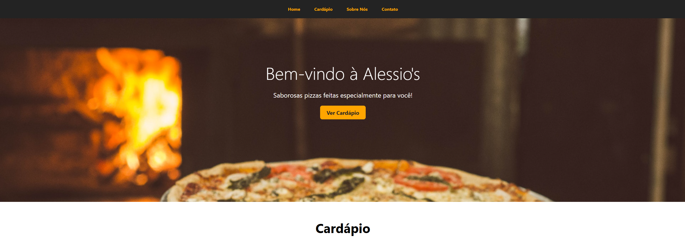

# 🌊 Seal World

> Projeto de uma landing page de pizzaria, onde temos seções de **home**, **cardápio**, **sobre nós** e **contato**. Este projeto veio do curso da OneBitCode!

## 📸 Imagem do Projeto


## 🛠️ Tecnologias Utilizadas
- HTML5
- CSS3 (incluindo imagens, positions, display, entre outros)

## 📦 Como visualizar o projeto localmente  
```bash
# Clone o repositório
git clone https://github.com/fcdias0812/Alessios_Pizzaria.git

# Acesse a pasta do projeto
cd Alessios_Pizzaria

# Abra o arquivo index.html no navegador
```

## 🎯 Aprendizados  
Esse projeto me ajudou a consolidar conceitos, podendo praticar os mesmos   
✔️ **display: inline-block** para ajudar no posicionamento  
✔️ **object fit e position** para posicionar melhor as imagens e vídeo  
✔️ **linear gradient** para escurecer imagens em background

## 📞 Contato  
📧 Email: dias.fabricio0812@gmail.com  
💼 LinkedIn: [Acesse meu LinkedIn](https://www.linkedin.com/in/fcdias0812/)